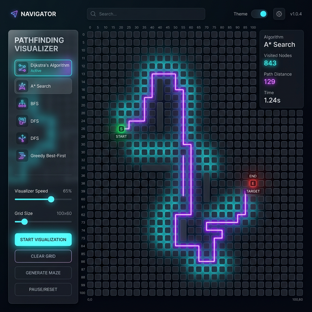
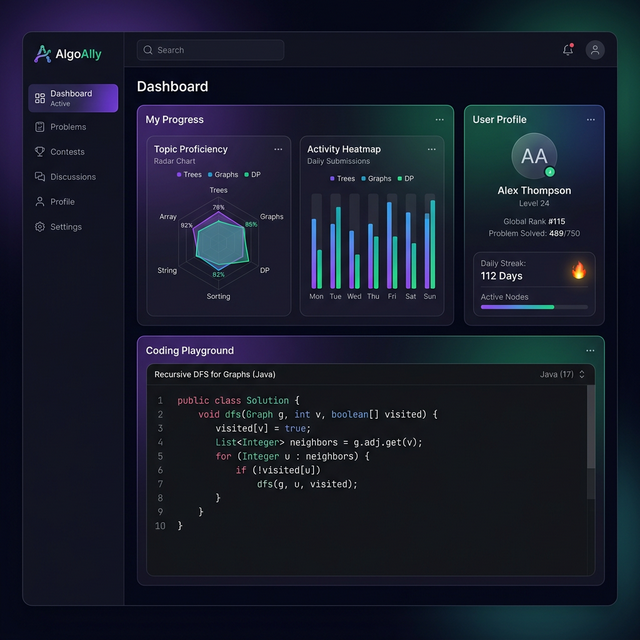

# 🚀 PlacementGPT

**PlacementGPT** is a comprehensive full-stack ecosystem designed to help developers master Data Structures and Algorithms (DSA) and prepare for technical interviews. It combines interactive visualization with a robust backend for persistent progress tracking.

---

## ✨ Key Features

- **📊 Algorithm Visualizer**: Interactive, real-time visualization of pathfinding algorithms (Dijkstra, A*, BFS, DFS) to help understand complex logic.
- **📚 Curated DSA Solutions**: A wide catalog of optimized solutions for common placement problems, categorized by topic.
- **👤 User Profiles & Progress**: Secure authentication (JWT) with persistent profiles to track completed tasks and learning milestones.
- **⚡ Real-time Sync**: Integration with external platforms like LeetCode to keep your stats updated in one dashboard.
- **🎨 Premium UI/UX**: Built with a modern aesthetic using Tailwind CSS and Shadcn UI, featuring dark mode and responsive design.

---

## � Preview

### 🔍 Pathfinding Visualizer


### 📊 Performance Dashboard


---

## �🛠️ Tech Stack

### Frontend
- **Framework**: React.js with TypeScript
- **Build Tool**: Vite
- **Styling**: Tailwind CSS & Shadcn UI
- **State Management**: React Query / Context API

### Backend
- **Framework**: Spring Boot (Java 17)
- **Security**: Spring Security with JWT (JSON Web Tokens)
- **Persistence**: Spring Data JPA
- **Database**: H2 (Development) / PostgreSQL (Production ready)

---

## 🚀 Getting Started

### Prerequisites
- Node.js (v18+)
- JDK 17
- Maven

### Installation

1. **Clone the Repo**
   ```bash
   git clone https://github.com/abhijeetkumar07/algo-ally-suite.git
   cd algo-ally-suite
   ```

2. **Frontend Setup**
   ```bash
   cd algo-ally-suite-main
   npm i
   npm run dev
   ```

3. **Backend Setup**
   ```bash
   cd backend
   mvn spring-boot:run
   ```
